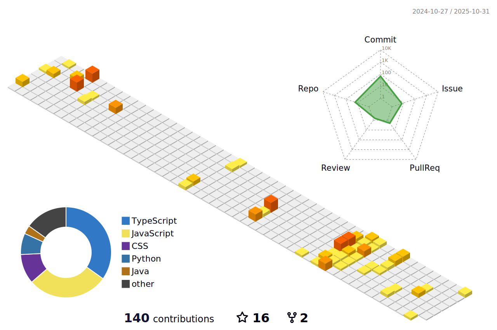

 
 
<a href = "nithinlycanz.github.io"><h2>I'm NithinLycanz</h2></a>

<h1> Languages and Tools</h4>

 

  <a href="https://skillicons.dev">
<!--     -->
    
  </a>

  <a href="https://skillicons.dev">
<!--     -->
   
  </a>

 

  
 

 

> If you have any questions you can message me on discord: **lycanz#5984**  
> **FIGMA**: https://www.figma.com/community/file  
> **LIVE** : https://nithinlycanz.github.io  
> check out [nithinp.t@mulearn](./profile/nithinp.t@mulearn.md) 
